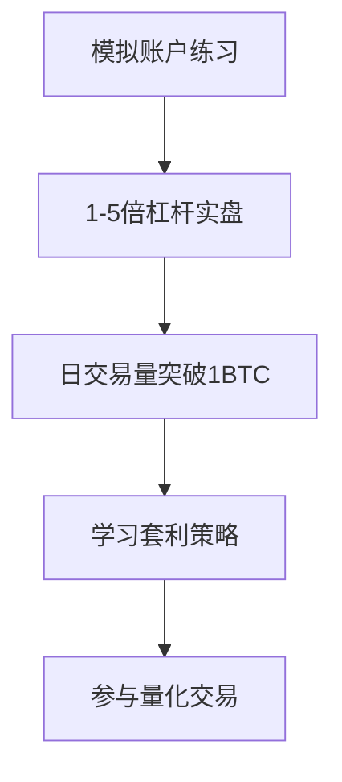

# 2025年十大加密货币杠杆交易平台推荐

👉 [立即体验OKX高杠杆交易](https://bit.ly/okx_welcome)

## 加密货币杠杆交易的核心价值

加密货币杠杆交易通过借贷资金放大交易规模，用较低本金获取更高收益潜力。例如10倍杠杆可将100美元交易规模提升至1000美元，但需注意风险与收益同步放大这一特性。2025年市场数据显示，主流平台平均提供50-150倍杠杆，专业机构用户更可获得最高400倍杠杆。

### 三大交易场景解析
| 场景类型 | 适用人群 | 杠杆范围 | 优势特点 |
|---------|---------|---------|---------|
| 短期套利 | 高频交易者 | 100-400x | 快速捕捉市场波动 |
| 趋势投资 | 专业投资者 | 50-125x | 管理大规模资金 |
| 新手练习 | 初级用户 | 1-10x | 风险可控学习 |

👉 [立即体验OKX高杠杆交易](https://bit.ly/okx_welcome)

## 2025年十大平台深度测评

### 1. MEXC - 专业级交易者的首选平台

作为全球领先的加密货币交易所，MEXC提供高达400倍杠杆的永续合约交易，支持超过2700个交易对。其核心优势体现在：
- **流动性优势**：日均期货交易量突破760亿美元
- **技术工具**：集成TradingView专业图表与网格交易机器人
- **安全保障**：持有美国MSB金融牌照，采用冷存储+热钱包双保险机制

> "MEXC的400倍杠杆模式让我的资金使用效率提升了3倍" - 资深交易员张明

👉 [立即体验OKX高杠杆交易](https://bit.ly/okx_welcome)

### 2. OKX - 智能交易的创新先锋

OKX凭借125倍杠杆和智能交易系统占据行业领先地位，其特色功能包括：
- **自动化交易**：支持API接入与量化策略部署
- **风险控制**：智能预警系统可提前30秒识别爆仓风险
- **合规优势**：已获欧盟MiCA牌照与迪拜DFSA认证

| 功能对比 | OKX | 行业平均 |
|---------|-----|---------|
| 最高杠杆 | 125x | 50x |
| API响应速度 | 50ms | 150ms |
| 资金费率 | 动态调整 | 固定费率 |

👉 [立即体验OKX高杠杆交易](https://bit.ly/okx_welcome)

### 3. Binance - 流动性王者的全面布局

币安持续巩固其全球最大交易所的地位，2025年新增特色包括：
- 推出HYPE/USDT等创新交易对
- VIP用户期货手续费降至0.02%
- 移动端交易体验全面升级

> 建议新手使用"简单模式"开始交易，逐步过渡到专业界面

## 风险控制与交易策略

### 四大风险管理工具
1. **动态止盈止损**：智能追踪价格波动，自动调整触发点
2. **仓位分仓管理**：支持单账户多仓位独立风控
3. **资金费率监控**：实时显示资金成本变化
4. **压力测试模拟**：预测极端行情下的风险敞口

### 新手进阶路线图

## 常见问题解答

Q：**如何选择适合自己的杠杆倍数？**
A：建议新手从1-5倍开始，逐步适应市场波动。专业交易者可根据资金规模选择50-100倍，需配合严格的止损策略。

Q：**爆仓后资金会消失吗？**
A：主流平台均采用分层保证金制度，最大损失不超过初始保证金。MEXC等平台还提供保险基金机制，进一步降低连带风险。

Q：**资金费率如何影响收益？**
A：以100倍杠杆为例，每8小时的资金费率约0.01%-0.03%。长期持仓需将资金成本纳入盈亏计算。

Q：**哪些指标预示爆仓风险？**
A：重点关注保证金率（建议保持20%以上）、强平价格偏离度（超过5%需警惕）、资金费率变化趋势。

Q：**如何利用模拟账户有效练习？**
A：建议设置与实盘相同的交易参数，重点训练：①波动行情应对 ②爆仓预警识别 ③止盈止损时机把握。

## 2025年交易趋势展望

随着欧盟MiCA法案的正式实施，合规化成为行业必然趋势。技术层面呈现三大方向：
1. **AI辅助交易**：机器学习算法预测资金费率变化
2. **跨链清算**：支持多链资产作为保证金
3. **社交化交易**：跟随策略收益分层机制

> 专家建议：在风险可控前提下，配置不超过总资产20%用于杠杆交易

👉 [立即体验OKX高杠杆交易](https://bit.ly/okx_welcome)