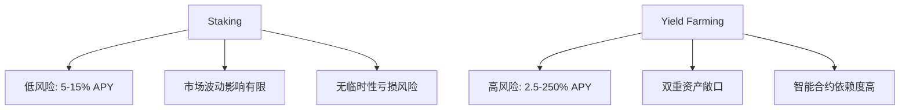

# Yield Farming与Staking：关键区别对比  

## 加密货币收益策略全景解析  

在DeFi领域，流动性提供者面临两种核心收益获取方式：**Yield Farming（流动性挖矿）** 与 **Staking（质押）**。前者通过向去中心化交易所（DEX）注入流动性获取高额年化收益，后者则依托权益证明（PoS）机制保障网络安全并获得稳定回报。本文将从技术原理、风险收益、操作门槛等维度展开深度对比，为投资者提供决策指南。  

---

## Staking：区块链安全的基石  

### 技术原理  
Staking基于**权益证明（PoS）共识机制**，通过质押代币参与区块验证，维护网络安全。与工作量证明（PoW）不同，PoS无需消耗算力资源，而是依据质押数量和时长决定验证权。用户可选择成为节点验证者或通过交易所参与质押，后者免去技术维护成本。  

### 核心优势  
- **低风险稳健收益**：年化收益率（APY）普遍在5%-15%，波动性远低于Yield Farming  
- **资产控制权保留**：通过非托管钱包质押（如CoinStats Wallet），资金始终由用户掌控  
- **网络去中心化贡献**：质押参与度越高，区块链抗攻击能力越强  

### 潜在风险  
| 风险类型          | 具体表现                          | 应对策略                     |
|-------------------|-----------------------------------|------------------------------|
| 市场波动风险      | 质押期间代币价格暴跌              | 选择优质项目、分散持仓       |
| 验证人风险        | 中心化交易所跑路或恶意扣押收益    | 优先选择去中心化质押方案     |
| 流动性限制        | 资产锁定周期最长可达365天         | 配置短周期质押产品           |
| 协议漏洞风险      | 智能合约被攻击导致资金损失        | 选择经过审计的项目           |

**FAQ**  
Q：Staking是否适合新手投资者？  
A：非常合适。其操作门槛低且收益稳定，适合希望获取被动收入且风险承受能力较低的用户。  

---

## Yield Farming：高收益背后的博弈  

### 运作机制  
通过向AMM（自动做市商）协议的流动性池注入资金对（如ETH/DAI），流动性提供者（LP）可获得交易手续费分成及平台代币奖励。例如Uniswap的0.3%交易手续费按流动性比例分配，同时Curve Finance通过CRV代币激励深度流动性。  

### 收益特征  
- **APY波动剧烈**：从2.5%到250%不等，受市场供需动态影响  
- **复利效应显著**：部分协议支持收益自动再投资  
- **跨协议套利机会**：通过在Aave、SushiSwap等平台间切换获取最优收益  

### 风险矩阵  
| 风险维度        | 风险说明                          | 缓释方案                     |
|-----------------|-----------------------------------|------------------------------|
| 临时性亏损      | 资产对价格波动导致的账面损失      | 选择低波动性交易对（如稳定币对） |
| 智能合约漏洞    | 协议被黑客利用漏洞攻击            | 聚焦头部协议（Yearn.Finance、Aave） |
| Gas费用侵蚀     | Ethereum网络拥堵时交易成本高昂    | 切换至BSC、Polygon等低Gas链  |
| 项目死亡螺旋    | 高APY吸引短期资金导致协议崩盘     | 跟踪TVL（总锁定价值）变化趋势 |

**FAQ**  
Q：如何判断Yield Farming的APY是否可持续？  
A：观察APY是否超过100%，若平台通过代币通胀维持高收益，需警惕价值稀释风险。  

---

## Yield Farming与Staking深度对比  

### 收益模式差异  
| 指标            | Staking                          | Yield Farming                  |
|-----------------|----------------------------------|--------------------------------|
| 收益来源        | 区块奖励+通胀补贴                | 交易手续费+协议代币奖励        |
| 收益稳定性      | ★★★★★                           | ★★☆☆☆                         |
| 操作频率        | 低（仅需初始质押）               | 高（需持续跨平台切换）         |
| 技术要求        | 基础区块链知识                   | DeFi协议交互经验               |

### 风险等级对比  

**FAQ**  
Q：为何稳定币流动性池更受欢迎？  
A：USDT/DAI等稳定币对波动率低，可最大程度降低临时性亏损风险，适合保守型流动性提供者。  

---

## 加密货币收益策略选择指南  

### 四步决策模型  
1. **风险评估**：保守型投资者首选Staking，进取型适合Yield Farming  
2. **资金规划**：预留至少30%流动性应对极端行情  
3. **项目筛选**：通过CoinGecko、DeFi Pulse核查协议安全评级  
4. **动态调整**：使用Zapper.Fi等工具监控APY变化  

👉 [一键获取DeFi收益优化方案](https://bit.ly/okx_welcome)  

### 2024年头部DeFi平台对比  
| 平台          | TVL（亿美元） | 核心优势                      | 风险提示                |
|---------------|---------------|-------------------------------|-------------------------|
| Aave          | 120           | 借贷市场龙头，利率透明        | 过往发生过闪电贷攻击    |
| Uniswap v3    | 50            | 集中流动性机制提升资本效率    | Gas费用较高             |
| Curve Finance | 80            | 稳定币兑换最优方案            | 激励代币CRV持续通胀     |
| Yearn.Finance | 30            | 收益聚合器自动化策略          | 依赖底层协议安全性      |

---

## 未来趋势与投资建议  

随着以太坊转向权益证明机制，Staking年化收益率预计提升至4%-8%，叠加流动性质押衍生品（如Lido）的发展，将进一步降低质押门槛。Yield Farming则呈现两极分化趋势：  
- **蓝筹协议**（如MakerDAO）通过稳定收益吸引长期资金  
- **新兴项目**依赖超高APY快速获取流动性，但可持续性存疑  

**实操建议**：  
- 新手组合：70%资金配置于蓝筹Staking（如ETH2.0），30%参与稳定币流动性池  
- 专业投资者：采用跨链Yield Farming策略，利用Arbitrum、Optimism等Layer2降低Gas成本  

👉 [把握加密货币牛市红利](https://bit.ly/okx_welcome)  

---

## 常见问题解答  

**Q：Staking是否会影响代币流动性？**  
A：是的，但通过流动性质押衍生品（如stETH）可实现代币质押期间的流动性释放。  

**Q：如何计算Yield Farming的真实收益？**  
A：使用APY计算器时需扣除：① Gas费用 ② 临时性亏损 ③ 代币价格波动因素  

**Q：哪些工具可监控DeFi风险？**  
A：推荐DeFi Safety（项目审计评级）、Impermanent.Info（临时性亏损计算器）、Dune Analytics（链上数据仪表盘）  

**Q：遭遇Rug Pull跑路事件怎么办？**  
A：立即通过区块链浏览器追踪资金流向，向慢雾、PeckShield等安全机构提交事件报告。  

**Q：质押ETH2.0需要多少门槛？**  
A：官方节点要求32 ETH，但通过交易所质押方案可实现零门槛参与。