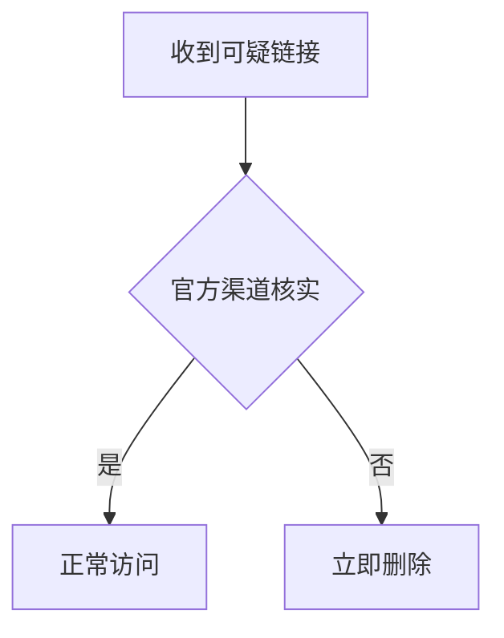

# 如何通过加密保护USDT钱包安全

> **随着USDT在数字货币交易中的广泛应用，其安全性问题日益凸显。本文将为您详细介绍如何通过加密措施保护USDT钱包安全，帮助您构建全方位的安全防护体系。**

---

## 一、了解 USDT 及其存储方式

USDT 是一种基于区块链技术发行的稳定币，其价值通常与美元保持 1:1 的比例。这使得它在市场波动较大的情况下，仍能提供价格稳定性。存储 USDT 主要有以下两种方式：

### 1.1 热钱包  
**特点**：连接互联网，交易便捷但安全性较低。  
**适用场景**：适合频繁交易的用户，但需配合其他安全措施。

### 1.2 冷钱包  
**特点**：离线存储，安全性高但操作复杂。  
**适用场景**：适合长期持有大额 USDT 的用户。

👉 [如何选择最适合您的钱包类型？](https://bit.ly/okx_welcome)

---

## 二、加强密码管理

密码是第一道防线，需遵循以下原则：

### 2.1 密码复杂性  
- 使用大小写字母、数字、特殊字符组合  
- 长度建议≥12位（示例：`U$D7-t3mP0!`）  

### 2.2 密码唯一性  
| 风险等级 | 同密码多平台使用 | 独立密码 |
|---------|------------------|----------|
| 高风险  | ✔                | ✘        |
| 低风险  | ✘                | ✔        |

### 2.3 定期更新策略  
- 每季度更换一次密码  
- 使用密码管理工具（如 Bitwarden、1Password）

---

## 三、启用双重身份验证（2FA）

### 3.1 2FA 的核心价值  
- 动态验证码生成器（推荐 Google Authenticator）  
- 避免因密码泄露导致的资金损失  

### 3.2 启用步骤  
1. 登录账户 → 设置 → 安全中心  
2. 扫描二维码绑定认证应用  
3. 保存恢复码（建议物理备份）  

👉 [立即开启您的2FA保护](https://bit.ly/okx_welcome)

---

## 四、私钥与助记词备份指南

### 4.1 核心原则  
| 安全等级 | 存储方式        | 风险指数 |
|----------|-----------------|----------|
| 低       | 云端文档        | ⚠️高风险 |
| 中       | U盘/硬盘备份    | ⚠️中风险 |
| 高       | 纸质+保险箱     | ✅低风险 |

### 4.2 多点备份策略  
- 家庭保险箱（主备份）  
- 亲友处（辅备份）  
- 避免使用以下方式：  
  - 手机备忘录  
  - 未加密邮件  

---

## 五、防范钓鱼攻击的实战技巧

### 5.1 识别钓鱼网站的三大特征  
1. 域名异常（如 `usdt-wallet.com` → `usdtwallet.com`）  
2. 缺乏 HTTPS 加密标识  
3. 强制要求下载附件或插件  

### 5.2 安全操作流程  

---

## 六、公共网络环境操作指南

### 6.1 风险规避策略  
| 风险类型   | 防护措施                  |
|------------|---------------------------|
| 中间人攻击 | 禁用公共Wi-Fi直接连接     |
| 数据窃取   | 使用移动数据替代          |
| 网络劫持   | 定期检查DNS设置           |

---

## 七、安全策略迭代机制

### 7.1 安全审查清单  
- [ ] 每月检查账户登录记录  
- [ ] 每季度更新密码策略  
- [ ] 每半年评估钱包类型适用性  
- [ ] 实时关注新型攻击手法  

👉 [获取最新加密安全白皮书](https://bit.ly/okx_welcome)

---

### 常见问题解答（FAQ）

**Q1：热钱包和冷钱包如何选择？**  
A：小额交易选热钱包，大额存储建议使用硬件冷钱包（如 Ledger、Trezor）。

**Q2：2FA验证码丢失怎么办？**  
A：提前备份的恢复码是关键，建议保存在至少两个物理位置。

**Q3：私钥泄露后如何处理？**  
A：立即转移资产至新钱包，检查设备是否存在恶意软件。

**Q4：如何验证钓鱼网站？**  
A：使用 WHOIS 查询域名注册信息，对比官方公告渠道。

**Q5：安全更新频率如何把控？**  
A：重大安全事件发生后立即更新，常规周期建议每季度调整策略。

---

> **安全无小事，预防胜于治疗**。通过系统性加密防护措施，您不仅能保障 USDT 资产安全，更能从容应对数字金融时代的各种挑战。