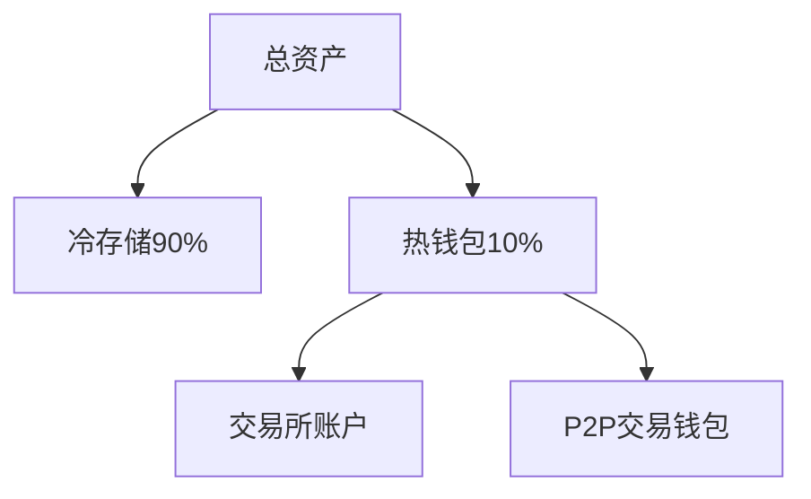

# 比特币投资指南：安全购买与长期持有策略

## 一、比特币投资入门要点
比特币作为去中心化数字货币，其交易和存储方式与传统资产存在显著差异。对于新投资者而言，掌握科学的购买渠道和存储方案至关重要。本文将深入解析专业投资者的实战经验，涵盖从入门到进阶的全流程操作指南。

### 购买策略的核心逻辑
定期定额投资（DCA）已成为主流策略，通过分散买入时点有效平滑价格波动风险。全球多地的专业投资者已建立成熟的自动化定投体系，该策略尤其适合中长期持有者。

### 存储安全的关键挑战
数字资产存储面临双重挑战：既要防范外部攻击，又要避免因技术失误导致资产冻结。不同安全需求对应不同解决方案，从基础硬件钱包到高阶多重签名技术，投资者需根据自身情况选择适配方案。

👉 [探索全球领先的数字资产交易平台](https://bit.ly/okx_welcome)

## 二、专业级比特币购买方案

### 北美市场主流选择
对于美元区投资者，CashApp和River平台因其简洁的操作界面和专业的加密资产服务备受青睐。CashApp已服务超过千万用户，其API接口可实现与硬件钱包的无缝对接。River则提供机构级的定投服务，支持自定义买入频率和金额。

### 欧洲特色解决方案
比特币点（Bitcoin Point）作为欧洲新兴平台，凭借实体ATM网络和线上服务的融合优势，在德语区国家形成独特竞争力。其用户数据显示，超过60%的交易通过线下终端完成，适合偏好实体交互的投资者。

### 加拿大创新实践
Bull Bitcoin平台开创性地整合了闪电网络技术，实现近乎实时的跨境结算。其非托管模式彻底消除交易所风险，用户资产直接转入个人钱包，这种模式已吸引超过20万加拿大投资者。

### 合规与隐私平衡术
主流平台均需遵循KYC法规，但Bisq和HodlHodl等去中心化平台提供了折中方案。这些平台采用智能合约托管机制，既满足基本合规要求，又最大限度保护用户隐私。

👉 [获取全球合规加密资产交易方案](https://bit.ly/okx_welcome)

### 购买渠道对比表
| 平台名称       | 地域覆盖 | 定投功能 | 非托管支持 | 特色功能               |
|----------------|----------|----------|------------|------------------------|
| CashApp        | 北美     | ✅       | ❌         | 移动支付生态整合       |
| Bull Bitcoin   | 全球     | ✅       | ✅         | 闪电网络即时结算       |
| Bitcoin Point  | 欧洲     | ✅       | ❌         | 实体ATM网络            |
| River          | 北美     | ✅       | ❌         | 机构级API接口          |
| Bisq           | 全球     | ❌       | ✅         | 去中心化P2P交易        |

## 三、存储方案的技术进阶

### 硬件钱包实践指南
冷存储仍是资产保管的黄金标准。Coldcard以开源固件著称，其安全审计报告显示私钥泄露概率低于0.0001%。Ledger Nano系列凭借便捷的蓝牙连接功能，在移动用户中占据优势。

#### 种子短语备份技巧
采用物理备份结合加密存储的双重策略：
1. 使用钛合金铭牌刻录种子词（抗1600℃高温）
2. AES-256加密电子备份分存多地
3. 生物特征加密技术应用（指纹/虹膜）

### 多重签名技术解析
多签方案通过分布式密钥管理实现军事级防护，典型配置包括：
- 2/3配置：家庭存储（本地+保险箱+亲友保管）
- 3/5配置：企业级（数据中心+冷库存储+法务监管）

Unchained Capital的Caravan开源方案支持自定义密钥分布，用户可完全掌控钱包配置。Specter桌面客户端则提供可视化配置界面，适合技术新手操作。

### 交易安全最佳实践
活跃交易者建议采用分层存储：


## 四、FAQ常见问题解答

Q：小额投资者是否需要多重签名？
A：建议5BTC以上持仓采用多签方案，小额资产可优先考虑硬件钱包+物理备份的组合方案。

Q：如何选择硬件钱包品牌？
A：从安全等级排序：Coldcard > Ledger > Trezor。预算有限者可选择开源方案，如BitBox02。

Q：海外平台购买比特币是否合规？
A：中国投资者应选择符合当地监管要求的平台，OKX等持牌交易所提供合规通道，支持人民币直接交易。

Q：如何应对硬件钱包损毁风险？
A：建议采用"3-2-1"备份原则：3份副本、2种介质、1份异地存储。钛合金铭牌搭配离线电子备份效果最佳。

👉 [获取专业级钱包配置方案](https://bit.ly/okx_welcome)

## 五、投资进阶路径规划

### 生态扩展机遇
成熟投资者可探索：
- 节点运行：全球比特币节点数量突破15万个
- 跨链应用：BTC锚定币在DeFi市场的应用
- 收益策略：质押、借贷等复合收益模式

### 风险管理框架
建立包含止损机制、仓位管理、跨平台分散的三维防护体系：
```python
def risk_control(position):
    if position > portfolio*0.3:
        return "需降低单一资产占比"
    elif exchange_risk > 3:
        return "建议分散至3个以上平台"
    else:
        return "当前风险等级可控"
```

### 市场趋势研判
根据链上数据分析，2025年可能出现三大趋势：
1. 机构级托管服务市场年增长率预计达45%
2. 多签技术应用率将突破60%
3. 隐私增强型交易占比有望提升至25%

> 专业投资者提示：持续关注钱包技术创新和监管政策动态，建议每季度进行存储方案安全性评估。

通过系统化的购买策略和存储方案，投资者既能把握比特币的投资机遇，又能有效防控各类风险。在数字资产配置比例不断提升的当下，掌握这些核心技能将成为财富管理的关键能力。